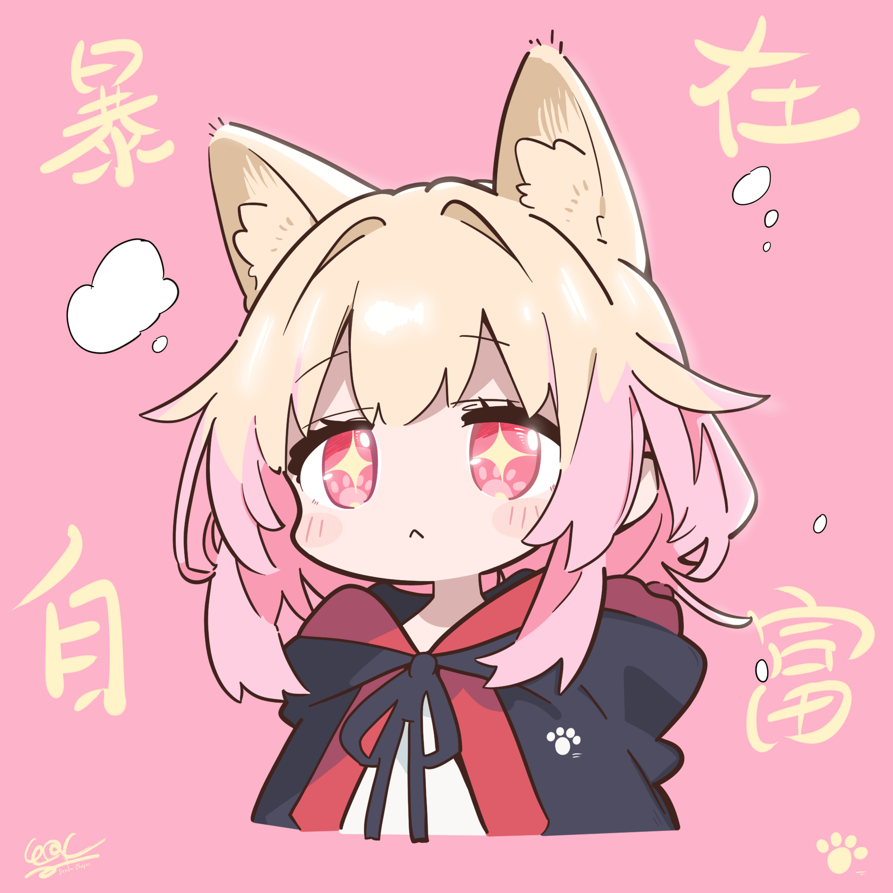

# Hi，我是 煻喵Toffee Meow (º﹃º ) 👋

<h3></h3>

 

- **一个热爱二维、三维相关设计制作的创作者**✨

- **喜欢平面排版、视频设计、三维渲染和TA技术美术**🌱

- **目前特别喜欢研究TA技术美术，对角色三渲二相关的TA技术尤为钟爱 ദ്ദി˶>𖥦<)✧**🔥

&nbsp;
&nbsp;
&nbsp;

### Github计分表⚡：

<!--

-->

### Github计划 ( ˶'ᵕ'˶)💡：
- **📜 [Shader魔法书](https://github.com/Toffee-Meow/Shader-Grimoire) 仓库持续更新中updating……**
  - **该项目作为个人🍭远程代码仓库，喜欢整理上传一些在各类游戏引擎当中玩过的Shader和自定义渲染管线**⭐

### 技能爱好 >ᴗoಣ😍：

<!--

-->

### 绘画作品 ੭ ᐕ)੭🐱：

    
<b>猫猫头ᗜ𖥦ᗜ<b>

    

    <blockquote>
      阔爱猫猫头
    </blockquote>
    

    

     
    

