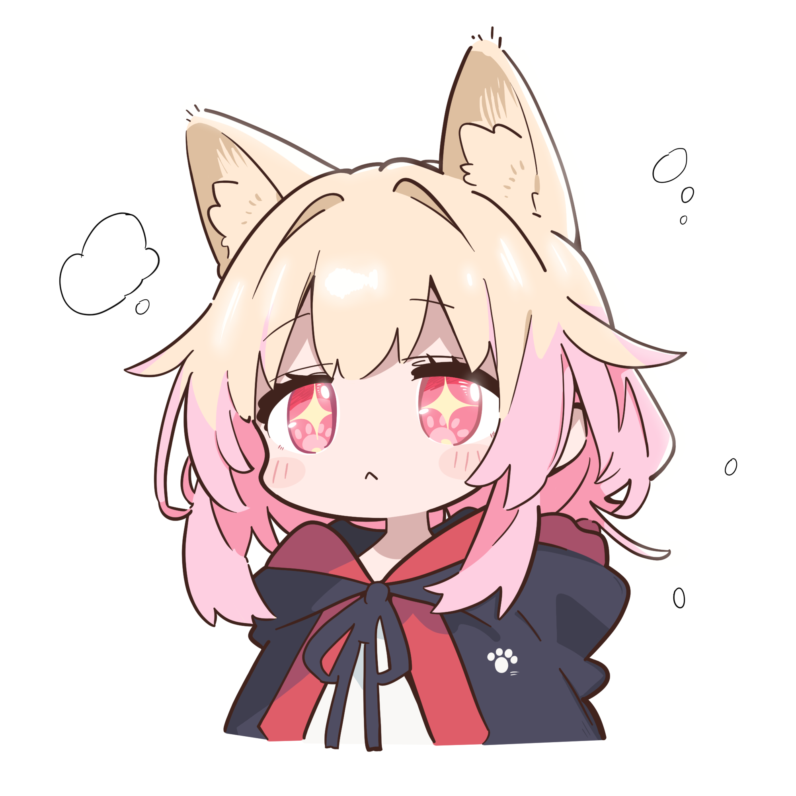

## Hi，我是 煻喵Toffee Meow (º﹃º ) 👋
#### 一个热爱二维、三维相关设计制作的创作者✨
#### 喜欢平面排版、视频设计、三维渲染和TA技术美术🌱

#### 目前特别喜欢研究TA技术美术，对角色渲染相关的TA技术尤为钟爱 ദ്ദി˶>𖥦<)✧🔥

### Github计分表⚡：

### 我所擅长的技能 >ᴗoಣ😍：

### 个人绘画作品 ੭ ᐕ)੭🐱：
> 猫猫头

 
    
猫猫头୧₍˄·͈༝·͈˄₎୨

     

